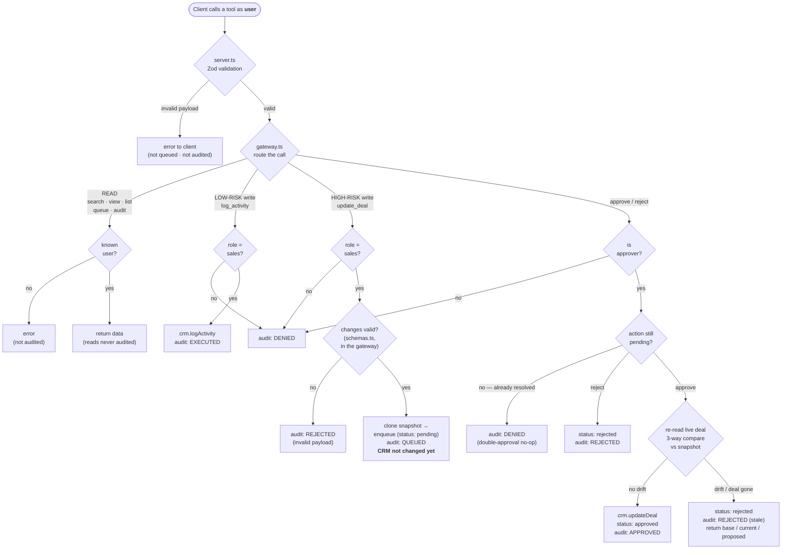

# Mini Agent Hub — governed MCP server for a CRM

An MCP server that lets an AI assistant work a CRM **safely**: low-risk writes execute
immediately, high-risk writes wait in an approval queue until an approver releases them,
permissions are enforced server-side, and every write, approval, and denial is audited.

Built for the WAIMAKERS coding challenge. Two users are seeded: `sara` (sales, approver —
reads and writes) and `victor` (viewer — reads only).

> **🤖 Reading this as an LLM or agent?** See **[`READMELLM.md`](./READMELLM.md)** — the same
> project condensed into a dense, structured spec (tool signatures, permission matrix, gateway
> decision rules, data shapes, invariants, file map) optimized for fast, unambiguous machine
> reading and for extending the code correctly.

---

## Project layout — every file

High modularity is deliberate: one responsibility per file, so the governance core stays
small, testable, and swappable. Nothing here is bigger than it needs to be.

```
gabriele_salvo_mini_agent_hub/
├── src/                       TypeScript source (the whole Hub)
│   ├── crm.ts                 (GIVEN, untouched) mock CRM — the "external system"
│   ├── crm-port.ts            CrmPort interface the Hub depends on instead of crm.ts
│   ├── mock-crm-adapter.ts    adapts crm.ts to CrmPort — the only file that imports crm.ts
│   ├── types.ts               shared data shapes: PendingAction, AuditRecord, Capability…
│   ├── schemas.ts             strict Zod validation for LLM payloads (runs before the queue)
│   ├── sequence.ts            monotonic id allocator (pa_1, au_1, …)
│   ├── permissions.ts         server-side role→capability map + approver gate
│   ├── audit-log.ts           append-only audit trail store
│   ├── approval-queue.ts      in-memory FIFO queue, status-guarded transitions
│   ├── gateway.ts             THE CORE — auth → risk → execute/queue → audit
│   └── server.ts              thin MCP wiring: registers the 10 tools, delegates to Gateway
├── data/
│   └── seed.json              seed users, contacts, deals, activities
├── dist/                      compiled JS + sourcemaps (generated by `npm run build`)
├── node_modules/              installed dependencies (created by `npm install`)
├── .mcp.json                  Claude Code project config — auto-registers the server
├── start.ps1                  one-command launcher (Windows): free ports → build → Inspector
├── start.sh                   one-command launcher (macOS/Linux): same, for bash
├── package.json               scripts (build/start/inspect/demo) + dependencies
├── package-lock.json          locked dependency tree
├── tsconfig.json              TypeScript compiler config (strict, ES modules)
├── .gitignore                 ignores node_modules/ and build output
├── README.md                  this file (human-facing)
└── READMELLM.md               machine-optimized spec of the same project (for LLMs/agents)
```

### The `src/` layering (who depends on whom)

Dependencies point in one direction — inward, toward the interfaces — so the core never
knows which CRM (or transport) it's running against:

| File | Responsibility | Depends on |
|---|---|---|
| `server.ts` | MCP transport, tool registration, composition root | `gateway`, `mock-crm-adapter`, `approval-queue`, `audit-log`, `schemas`, `types` |
| `gateway.ts` | the governance orchestration (gate + audit) | `crm-port`, `permissions`, `audit-log`, `approval-queue`, `types`, `crm` (types only) |
| `permissions.ts` | who may read / write / approve | `types`, `crm` (types only) |
| `approval-queue.ts` | hold & resolve pending actions | `sequence`, `types`, `crm` (types only) |
| `audit-log.ts` | append-only record store | `sequence`, `types` |
| `mock-crm-adapter.ts` | implement `CrmPort` over `crm.ts` | `crm-port`, `crm`, `types` |
| `crm-port.ts` | the CRM contract the Hub codes against | `crm` (types), `types` |
| `types.ts` | shared data shapes | `crm` (Deal/DealStage types) |
| `schemas.ts` · `sequence.ts` | Zod validation · id allocator | (nothing internal) |

The whole governance layer performs every CRM **operation** through the `CrmPort` interface —
`mock-crm-adapter.ts` is the *only* file that ever calls `crm.ts`. Several files do re-use
crm.ts's **type** declarations (`Deal`, `User`, `DealStage`) via `import type`, but that is
compile-time only and erased at runtime, so it creates no real coupling. To add a second CRM
backend you write one new class implementing `CrmPort` and swap it in `server.ts` — no
gateway, queue, audit, or permission code changes.

### Reading order — how one tool call flows through the files

To understand the codebase (or to walk someone through it), follow a single request top to
bottom. Take `update_deal` proposed by Sara, then approved:

1. **`server.ts`** (entry point). The client calls the `update_deal` tool. `server.ts` first
   validates the raw arguments against a Zod schema from **`schemas.ts`** — this is where a
   malformed payload or an invented field (e.g. `priority`) is rejected *before* anything else
   runs. If valid, it calls the matching Gateway method. It contains no business logic; it only
   connects MCP to the Gateway and serializes the reply.
2. **`gateway.ts`** (the heart). It resolves the acting user and asks **`permissions.ts`**
   whether that user holds the required capability. If not, it writes a single `denied` record
   to **`audit-log.ts`** and stops — this is where Victor is blocked. If allowed, it classifies
   the risk: a low-risk write (`log_activity`) is applied immediately; a high-risk write
   (`update_deal`) is **snapshotted** (a clone of the current deal) and handed to
   **`approval-queue.ts`**, and a `queued` record is written. Nothing hits the CRM yet.
3. **`permissions.ts`** (pure decision). Given a user and a capability it returns allowed/denied
   with a human-readable reason. No state, no I/O — trivial to read and to trust.
4. **`approval-queue.ts`** (the wait). It stores the pending action and guards its lifecycle
   (`pending → approved | rejected`). Later, when Sara calls `approve_pending_action`, the
   Gateway re-reads the deal, compares it against the stored snapshot for staleness, and only
   then applies the change and marks the action approved (writing an `approved` record).
5. **`crm-port.ts` + `mock-crm-adapter.ts`** (the CRM boundary). The Gateway only ever speaks to
   the **`CrmPort` interface**; `mock-crm-adapter.ts` is the concrete implementation that
   forwards to the provided `crm.ts`. This one file is the seam you'd replace to swap CRMs.
6. **`audit-log.ts`** (the record). Every step above appends exactly one record here. Reading it
   back with `view_audit_log` reconstructs the whole story — proposed, approved, by whom, when.

Underpinning all of it: **`types.ts`** (the shared data shapes every file agrees on),
**`schemas.ts`** (payload validation), and **`sequence.ts`** (the `pa_1` / `au_1` id counters).

---

## Setup and how to run it

Requires Node 18+.

```bash
npm install
```

### One command (recommended)

Builds the server and launches the [MCP Inspector](https://github.com/modelcontextprotocol/inspector)
with our server wired in as its child. It first frees the Inspector's ports, so a leftover
proxy from a previous run never blocks you:

```powershell
npm run demo          # Windows (runs start.ps1)
```

```bash
npm run demo:unix     # macOS / Linux (runs start.sh)
```

Then open the Inspector URL it prints, hit **Connect**, and use the **Tools** tab.

### Or the plain steps

```bash
npm run build
npm run inspect       # build + launch the Inspector (no automatic port cleanup)
```

Every tool takes a `user` argument (`sara` or `victor`) that stands in for authentication.

> If the Inspector says a port is already in use, a previous Inspector proxy is still
> running. `npm run demo` clears it automatically; otherwise stop that process and retry.

### Use it from Claude Code

This repo ships a project-scoped **`.mcp.json`**, so Claude Code picks the server up
automatically:

```bash
npm run build          # dist/server.js must exist
claude                 # start Claude Code in this folder
```

On first launch Claude Code asks to trust the server — approve it, then run `/mcp` to see
**mini-agent-hub** connected with its 10 tools. (Or add it explicitly:
`claude mcp add mini-agent-hub -- node dist/server.js`.)

You drive it in natural language, telling Claude **which user to act as**:

- *"As **sara**, show me deal d1."* → `view_deal`
- *"As sara, log an activity on d1: 'Called Hendrik, positive.'"* → `log_activity` (executes)
- *"As sara, propose changing d1 to stage negotiation, value 50000."* → `update_deal` (queues `pa_1`)
- *"Show the pending queue, then as sara approve pa_1."* → `view_pending_queue` + `approve_pending_action`
- *"As **victor**, log an activity on d1."* → **denied**, and audited
- *"Show the audit log."* → `view_audit_log`

Each session spawns its own server process, so state persists across your messages and resets
when you restart. Windows note: if `node dist/server.js` doesn't launch under Claude Code, use
the shim `claude mcp add mini-agent-hub -- cmd /c node dist/server.js`.

### Use it from Claude Desktop / another MCP client

Point it at the built server with an absolute path:

```json
{
  "mcpServers": {
    "mini-agent-hub": {
      "command": "node",
      "args": ["<absolute-path>/gabriele_salvo_mini_agent_hub/dist/server.js"]
    }
  }
}
```

### How to use the tools (worked demo)

Run these in the Inspector's **Tools** tab in order. Each row is a tool + the exact
arguments to enter. This is also a ready-made script for the screen recording.

| # | Tool | Arguments | What you should see |
|---|---|---|---|
| 1 | `view_deal` | `user: sara`, `dealId: d1` | Deal `d1` at stage `proposal`, value `45000`. |
| 2 | `log_activity` | `user: sara`, `dealId: d1`, `note: Called Hendrik, positive.` | **Executes immediately.** Note is saved. |
| 3 | `update_deal` | `user: sara`, `dealId: d1`, `stage: negotiation`, `value: 50000` | **Queued** as `pa_1`. The deal is *not* changed yet. |
| 4 | `view_deal` | `user: sara`, `dealId: d1` | Still `proposal` / `45000` — proving the queue actually gates. |
| 5 | `view_pending_queue` | `user: sara` | One item: `pa_1`, status `pending`, with its snapshot. |
| 6 | `approve_pending_action` | `user: sara`, `actionId: pa_1` | **Approved.** Now the change hits the CRM. |
| 7 | `view_deal` | `user: sara`, `dealId: d1` | Now `negotiation` / `50000`. |
| 8 | `log_activity` | `user: victor`, `dealId: d1`, `note: anything` | **Denied** — Victor is a viewer. Denial is audited. |
| 9 | `update_deal` | `user: victor`, `dealId: d2`, `changes: {"value":1}` | **Denied** — server-side, no matter what the AI sends. |
| 10 | `view_audit_log` | `user: sara` | The whole story, newest first: executed, queued, approved, and both denials. |

Notes:
- **Two ways to update:** fill `stage` / `value` / `notes` directly (the friendly way), or pass a
  raw `changes` object (advanced). Both funnel through the same gateway validation and audit.
- **Partial update:** `update_deal` only changes the fields you include — omit `notes` and the
  existing notes are left as-is. (A full-object "replace the whole deal" mode is a deliberate
  non-goal for the core; it'd be a "with more time" addition.)
- **`pa_N` ids accumulate across a session:** approve the id you *just* created, not always `pa_1`.
- **Reject instead of approve:** `reject_pending_action` with `user: sara`, `actionId: pa_2`, optional `reason`.
- **Stale conflict:** queue an `update_deal` (get `pa_N`), then approve a *different* update to the
  same deal first, then approve `pa_N`. It is rejected as stale and returns a
  `{ field, base, current, proposed }` comparison to re-propose from.
- **Malformed payload:** send `update_deal` with `changes: {"priority":"high"}`. It is rejected by
  validation before it ever reaches the queue — and, unlike a raw transport error, the attempt
  is recorded in the audit log as `rejected` ("Invalid payload: …").
- **Victor can still read:** `view_audit_log` / `view_pending_queue` as `victor` work — reads are open.

---

## Starting data (the seed)

Everything is seeded from `data/seed.json` into memory, so **restarting the server resets to
exactly this state** (and the `pa_N` / `au_N` counters restart at 1) — handy for a clean demo.

**Users** (the `user` argument):

| id | name | role | approver | can |
|---|---|---|---|---|
| `sara` | Sara de Vries | sales | yes | read, write, approve |
| `victor` | Victor Lam | viewer | no | read only |

**Deals** (`list_deals` / `view_deal`):

| id | contact | title | stage | value |
|---|---|---|---|---|
| `d1` | c1 · Hendrik Jansen (Jansen Logistics BV) | Fleet tracking rollout | proposal | 45000 |
| `d2` | c2 · Emma Bakker (Bakker & Partners) | Legal workflow automation | qualified | 18000 |
| `d3` | c3 · Lucas Visser (Visser Installaties) | Service planning pilot | negotiation | 27500 |
| `d4` | c4 · Sophie van Dijk (Van Dijk Retail Group) | Store analytics dashboard | lead | 60000 |

Four contacts (`c1`–`c4`, searchable by name or company) and one seed activity (`a1` on `d1`)
round it out. The **pending queue and audit log both start empty** — the first proposal is
`pa_1` and the first audit record is `au_1`.

---

## The tools

| Tool | Who | Effect |
|---|---|---|
| `search_contacts`, `list_deals`, `view_deal`, `list_deal_activities` | any user | read (not audited) |
| `log_activity` | sales | **low-risk write — executes immediately** |
| `update_deal` | sales | **high-risk write — queued for approval** |
| `view_pending_queue` | any user | read the queue |
| `approve_pending_action` | approver | apply a queued change (re-checks freshness) |
| `reject_pending_action` | approver | drop a queued change |
| `view_audit_log` | any user | read the trail |

### Permission model (server-side)

Two independent dimensions, so the model has no special cases:

- **role** — `sales` gets `read + write_low_risk + write_high_risk`; `viewer` gets `read`.
- **approver flag** — gates `approve`, independent of role.

The gateway checks this on **every** call; no tool can bypass it. Reads are open to any
authenticated user — an auditor reconstructs what the agent *changed*, not what anyone *read*.

> **Design choice — reads aren't audited, including failed ones.** Successful reads leave no
> record on purpose (the trail is about changes, not lookups). A consequence: an *unknown* user's
> read attempt is rejected **silently**, whereas an unknown user's *write or approve* is audited
> as `denied`. That asymmetry is intentional for the core — but a failed-auth read is really a
> security event, not a normal read. In a hardened deployment you'd also log unknown-user read
> attempts (repeated probes are worth seeing) as an authentication signal. It's a small,
> localized change in `requireReader` (`gateway.ts`) — audit the `!user` branch, threading in the
> tool name; we left it out to keep reads genuinely side-effect-free.

### Authentication — what's here, and how we'd make it real

**What's here (the boilerplate's model).** Identity is the `user` string passed with each tool
call; the gateway resolves it via `crm.getUser(user)` to a `{ role, approver }` record in the
seed directory. There is **no verification** — no token, session, or header (confirmed: the
codebase has zero auth-handling code) — so the string is trusted verbatim. The transport is
**stdio**: a local process launched by one operator, so "whoever started the server" is the
implicit trust boundary. This is a deliberate stand-in — the brief states the `user` arg "stands
in for real authentication," and for a local, single-user challenge that is appropriate.

**How we'd make it real** (this is also what the remote/Cloudflare stretch would require):

1. **Move off stdio to a remote transport** (MCP Streamable HTTP). Auth only becomes meaningful
   once the server is reachable by more than the person who launched it.
2. **Adopt MCP's Authorization spec** — OAuth 2.1 (authorization-code + PKCE). The server acts as
   an OAuth **resource server** and validates a **bearer token** on every request.
3. **Derive identity from the token, not a tool argument.** `actorId` becomes the verified token
   subject/claims, and the `user` tool arg is **removed** so the AI can never assert an identity.
4. **Map the verified subject → role/permissions centrally** — from IdP / JWT claims (e.g. group
   membership) or an external RBAC/ABAC store or policy engine (e.g. Open Policy Agent).
   `permissions.ts` becomes the policy-decision point, fed by *verified* identity.
5. **Audit `actor` = the verified subject**, so the trail is cryptographically attributable.

**What changes vs. stays.** Only the *identity source* (token instead of arg) and the *permission
data source* (IdP/policy store instead of seed) change — plus dropping the `user` arg. The
gateway, approval queue, audit trail, validation, and every tool stay exactly as they are. That
one-place change is the payoff of routing every call through a single choke point.

---

## Data model

### PendingAction (approval queue item)

```ts
interface PendingAction {
  id: string;                 // monotonic, e.g. "pa_1" — unique by construction, never reused
  type: "update_deal";        // union, so new high-risk actions stay type-safe
  dealId: string;
  changes: DealChange;        // the proposed change (stage / value / notes)
  snapshot: Deal;             // COPY of the deal at propose time — base of the 3-way compare
  proposedBy: string;
  status: "pending" | "approved" | "rejected";
  createdAt: string;          // ISO 8601
  resolvedBy?: string;
  resolvedAt?: string;
}
```

`snapshot` is a **clone**, not a reference: `crm.getDeal()` returns the live object and
`crm.updateDeal()` mutates it in place, so a reference would silently change under us.

### AuditRecord (one shape for every governed path)

```ts
interface AuditRecord {
  id: string;                 // monotonic, e.g. "au_1"
  timestamp: string;          // ISO 8601
  actor: string;              // user the AI acted for
  action: string;             // tool name, e.g. "update_deal"
  outcome: "executed" | "queued" | "approved" | "rejected" | "denied";
  dealId?: string;
  before?: unknown;           // cloned deal state before the change
  after?: unknown;            // cloned deal state after it was APPLIED (executed / approved) — absent on "queued"
  changes?: DealChange;       // the proposed diff, on proposal records (queued / approved / rejected)
  reason?: string;            // why denied / rejected (e.g. "viewer cannot write", "stale: value")
  pendingActionId?: string;   // links an audit record back to its queue item
}
```

The log is **append-only** — records are never mutated or deleted, and `before`/`after` are
clones so nothing can rewrite history after the fact. A **`queued`** record shows the current
deal (`before`) and the proposed diff (`changes`) but **no `after`** — nothing has been applied
yet, so an `after` only appears once the change is actually applied (`approved` / `executed`).
**Audit coverage — stated precisely.** Every *state-changing* action **and** every *blocked*
write/approval attempt produces exactly one record: a direct write (`executed`), a queued
proposal (`queued`), an approval (`approved`), an approver / stale / invalid-payload rejection
(`rejected`), and a permission-or-unknown-user denial (`denied`). **Pure reads produce no
record** — including `view_deal`, `view_pending_queue`, and `view_audit_log` — by design: the
trail reconstructs what the agent *changed*, not what it *looked at*. So "everything is audited"
means every write, approval, and blocked attempt — not read-only calls (see the read-audit
trade-off under the permission model above).

**Two naming choices worth flagging (the brief asks *why* we chose what we chose):**

- The brief lists this outcome as `pending`; we named it **`queued`** on purpose, so the audit
  *event* ("the write was queued") is never confused with a `PendingAction`'s
  `status: "pending"` *state*. It also reads naturally with the FIFO queue.
- **`rejected`** intentionally also covers write attempts that never entered the queue — a
  malformed `update_deal` payload, or a write aimed at a non-existent deal — not only
  approver/stale rejections. We kept the audit trail complete rather than add a separate
  `failed` outcome; the `reason` field says which case it was.

### Flow

Validate → check permissions **server-side** → route by risk. A high-risk write never touches
the CRM until it is approved. This renders as a diagram on GitHub and any Mermaid-aware viewer:



> A write aimed at a non-existent deal is handled the same defensive way: it never touches the
> CRM and is recorded as `audit{rejected}` (reason "deal not found"). See Edge cases.

### Edge cases handled

- **Double approval** — only a `pending` action can transition; a second approve/reject of
  the same id is a no-op that is still audited.
- **Stale data** — on approval the deal is re-read and compared field-by-field against the
  snapshot; if a changed field drifted, the action is rejected (not silently overwritten) and
  the approver gets a `{ field, base, current, proposed }` comparison to re-propose from.
- **Unauthorized / unknown user** — denied server-side and audited.
- **Deal missing on approval** — rejected and audited (defensive: the mock CRM has no delete,
  so this can't occur today, but the guard makes the model safe if it ever gains one).
- **Malformed payload** — the gateway validates every `update_deal` payload with a strict Zod
  schema (invented fields, wrong types, empty change) before anything reaches the queue, and
  records the blocked attempt as `outcome: rejected` (reason `"Invalid payload: …"`). Validation
  lives in the governed path — not only at the transport layer — precisely so the attempt is
  audited. A viewer's malformed write is still `denied` first: permission is checked before
  validation.

---

## Three conscious trade-offs

1. **Everything is in-memory (queue + audit + id counters).** Chosen to keep the core clean
   and reviewable within the time box. The cost: no persistence (a restart loses state and
   resets the `pa_N`/`au_N` counters, which could collide with previously persisted ids), and
   no safety across multiple instances. **With more time:** Postgres (or an append-only store)
   for the audit log, a durable queue for approvals, and a DB sequence or ULID/UUID for ids —
   ideally an opaque id with a friendly alias for readability.

2. **Stale proposals are rejected, not auto-merged.** On drift I reject and return a 3-way
   comparison, letting a human re-propose against current state — safe and easy to reason
   about. The cost: an approver does one extra step even when the change is trivially
   compatible. **With more time:** field-level auto-merge for non-conflicting fields, and a
   `force_approve` path for deliberate overrides, both fully audited.

3. **A `user` string plus a static role→capability map stands in for auth and policy.** This
   matches the challenge's stand-in-for-auth framing and keeps permissions in one obvious
   place. The cost: it isn't real identity, and autonomy is hard-coded rather than
   configurable. **With more time:** real authentication, and the Agent Hub's actual model —
   per-client, per-action-type autonomy that an agent *earns* by building a track record in
   the audit log.

---

## Scope: stretch goals, and why the adapter is a design choice — not a half-finished stretch

The brief lists three optional stretch goals ("pick at most one"). **None were attempted:**

| Stretch goal | Status |
|---|---|
| Weekly digest (`weekly_summary`) | Not attempted |
| Second CRM (adapter interface **+ a second backend** proving CRM-agnosticism) | Not attempted |
| Ship to Cloudflare Workers | Not attempted |

At a glance the `CrmPort` interface can look like "half of the Second CRM stretch." It isn't,
and the distinction is deliberate:

- **The adapter is a core design decision, made for the core's sake.** WAIMAKERS' whole thesis
  is *one governed gateway over business systems*. If the gateway, audit trail, and permission
  logic imported `crm.ts` directly, the governance layer would be welded to one vendor's API —
  the opposite of a "hub." So the Hub depends on the `CrmPort` **interface** (dependency
  inversion); `MockCrmAdapter` is the single module that knows a concrete CRM exists. That
  decoupling earns its place purely by keeping the core clean and testable, regardless of
  whether a second CRM ever shows up.

- **The stretch goal is the *proof*, and that's the part I consciously skipped.** The "Second
  CRM" stretch isn't "have an interface" — it's "add a second mock backend behind it, proving
  the gateway and audit code don't care which CRM is underneath." That proof is a second,
  throwaway mock adapter. I stopped at the boundary on purpose: a disposable second backend
  adds mock code without adding *design* insight, and the brief is explicit that a clean core
  beats a rushed everything. The decoupling is already visible in the code — every Hub module
  imports `CrmPort`, none import `crm.ts` — so the architectural point stands on its own.

So it's not 50% of a stretch; it's 100% of a design stance, with the optional stretch left
cleanly untouched. Finishing the stretch later is a ~30-minute add precisely *because* the
design choice was already made: write one more class that implements `CrmPort`, swap it in
`server.ts`, and every gateway/queue/audit/permission line keeps working unchanged.
